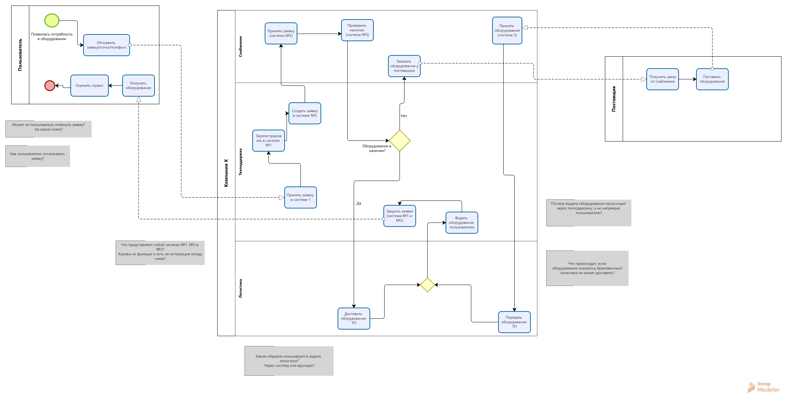

# IT Equipment Request Process 

Смоделирован текущий процесс выдачи оборудования пользователям.

Отражены:

* взаимодействие между поддержкой, снабжением и логистикой
* работа нескольких систем
* сценарии при наличии и отсутствии оборудования

## Диаграмма

